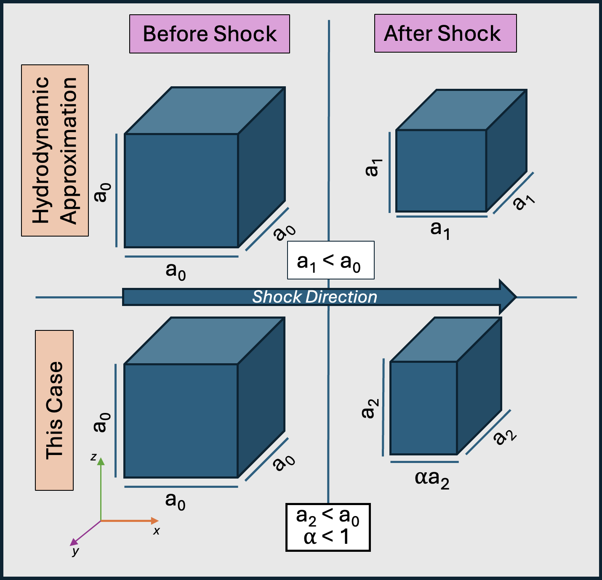
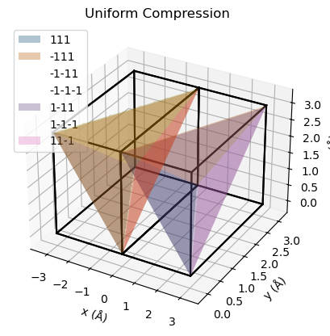

# Compression along an axis
Hydrodynamic approximation (used for Hugoniot relations) assumes that diamond will compress *uniformly* on all axes under laser shock.  
  
Diamond is strong. So what happens if the hydrodynamic approximation is not valid (as Winey found)? Then the strength of diamond will resist compression along the other axes, and we will have a greater compression in the direction of the shock (100 in our case).
<div>

</div>
In this notebook, I will look at how the d-spacing of different 111 planes changes as this phenomenon happens. Is it constant? Or does it change? If it changes, it would explain our off-hugoniot peaks in the data.
<div>

</div>


```python
from XRD import * #import functions
%matplotlib inline

a = 3.02 #lattice param @ 560 GPa
alpha = 0.9
print("=======================")
for i, alpha in enumerate([1, 0.9]):
    title = "Uniform Compression" if i == 0 else "Uniaxial Compression"
    diamond = CellMaster(alpha*a, a, a)
    diamond.add_unit_cell([0, 0, 0]) #add the base unit cell
    diamond.add_unit_cell([-alpha*a, 0, 0]) #add an adjacent unit cell
    for reflection in [[1,1,1], [-1, 1, 1], [-1, -1, 1], [-1, -1, -1], [1, -1, 1], [1, -1, -1], [1, 1, -1]]:
        diamond.get_plane(reflection)
    diamond.plot_cells(title=title)
    plt.show()
    diamond.get_d_spacings()
    print("=======================")
```

    =======================


    

    


    ________________________________
    |  h, k, l | d-spacing          |
    |  1, 1, 1 | 1.7435978129526697 |
    | -1,-1,-1 | 1.7435978129526697 |
    | -1,-1,-1 | 1.7435978129526697 |
    | -1,-1,-1 | 1.7435978129526697 |
    |  1,-1,-1 | 1.7435978129526697 |
    |  1,-1,-1 | 1.7435978129526697 |
    |  1, 1,-1 | 1.7435978129526697 |
    --------------------------------
    =======================


    

    


    ________________________________
    |  h, k, l | d-spacing          |
    |  1, 1, 1 | 1.6791860078189556 |
    | -1,-1,-1 | 1.6791860078189556 |
    | -1,-1,-1 | 1.6791860078189556 |
    | -1,-1,-1 | 1.6791860078189556 |
    |  1,-1,-1 | 1.6791860078189556 |
    |  1,-1,-1 | 1.6791860078189556 |
    |  1, 1,-1 | 1.6791860078189556 |
    --------------------------------
    =======================

